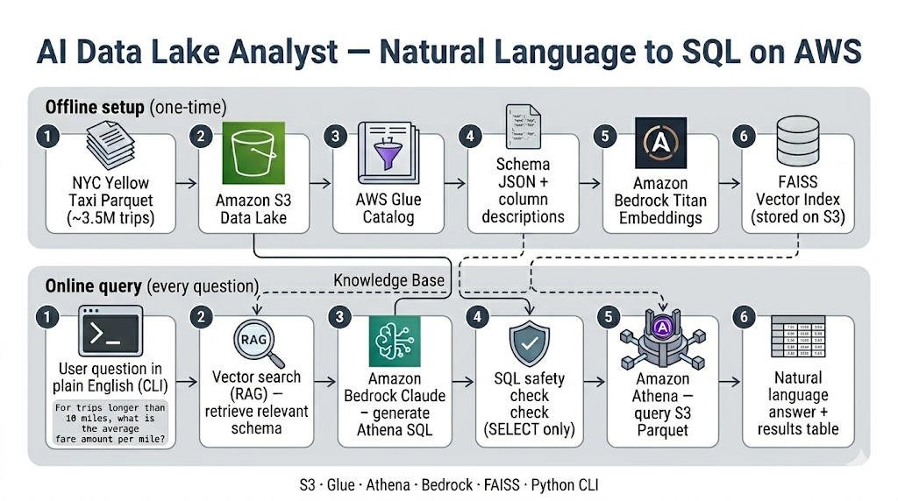

# AI Data Lake Analyst

Natural-language analytics over **3.4M+ NYC Yellow Taxi trips** stored in an AWS data lake. Ask a question in plain English — the system retrieves relevant schema context via **RAG**, generates **Athena SQL** with **Amazon Bedrock (Claude)**, runs the query, and returns a human-readable answer.

---

## Highlights

- **RAG over Glue metadata** — semantic search finds the right columns before SQL generation
- **Text-to-SQL** — Claude on Bedrock writes Athena-compatible queries
- **Serverless lakehouse** — S3 Parquet, Glue Catalog, Athena (no warehouses to manage)
- **Cost-conscious** — FAISS vector index on S3; pay-per-query Athena; no OpenSearch cluster
- **Read-only safety** — generated SQL is validated (SELECT only, no DDL/DML)

---

## Architecture



### End-to-end flow

1. **Ingest** — Parquet trip files land in S3 under a partitioned prefix.
2. **Catalog** — Glue crawler registers the table; schema is exported to JSON with business descriptions.
3. **Embed** — Column/table descriptions are embedded with Titan and indexed in FAISS (uploaded to S3).
4. **Ask** — User question is embedded and matched against metadata (RAG).
5. **Generate** — Claude receives retrieved schema context and writes Athena SQL.
6. **Execute** — SQL runs on Athena; results are summarized back to natural language.

---

## Tech stack

| Layer | Technology |
|-------|------------|
| Data lake | Amazon S3 (Parquet) |
| Catalog | AWS Glue |
| Query engine | Amazon Athena |
| Embeddings | Amazon Bedrock — Titan Embed Text v2 |
| LLM | Amazon Bedrock — Claude 3 Sonnet |
| Vector search | FAISS (IndexFlatIP, stored on S3) |
| Python | boto3, AWS Data Wrangler, pandas |
| Interface | CLI (`cli.py`) |

---

## Project structure

```
.
├── cli.py                    # Main entry point — ask questions
├── src/
│   ├── ai_analyst.py         # RAG + SQL generation + answer synthesis
│   ├── config.py             # Environment-based configuration
│   ├── embedding.py          # Bedrock Titan embeddings
│   ├── glue2json.py          # Export Glue schema → JSON
│   ├── query_engine.py       # Athena execution + SQL safety checks
│   └── vector_store.py       # FAISS build, S3 storage, similarity search
├── docs/
│   └── architecture.png      # System architecture diagram
├── examples/
│   └── sample_questions.txt  # Demo questions for CLI
├── yellow_taxi_schema.json   # Schema + TLC column descriptions for RAG
├── view_parquet.py           # Local Parquet inspector (dev utility)
├── requirements.txt
├── .env.example
└── .gitignore
```

---

## Prerequisites

- AWS account with IAM credentials configured (`aws configure`)
- **Amazon Bedrock** model access enabled (Claude 3 Sonnet + Titan Embeddings)
- S3 bucket with taxi Parquet data uploaded
- Glue database `nyc_taxi` with table `yellow_taxi`
- Athena workgroup with an S3 results location configured

### Dataset

Download NYC Yellow Taxi Parquet from the [TLC Trip Record Data](https://www.nyc.gov/site/tlc/about/tlc-trip-record-data.page) page (not included in this repo due to size).

Example local file: `yellow_tripdata_2025-01.parquet` (~59 MB, 3.4M rows)

---

## Setup

```bash
git clone https://github.com/shivasb42/AI-Data-Lake-Analyst.git
cd AI-Data-Lake-Analyst

python3 -m venv venv
source venv/bin/activate
pip install -r requirements.txt

cp .env.example .env
# Edit .env with your bucket names and region
```

Configure AWS:

```bash
aws configure
aws sts get-caller-identity
```

---

## Usage

### 1. Export schema from Glue (optional refresh)

```bash
cd src && python glue2json.py && cd ..
```

### 2. Build and upload vector index (run once)

```bash
cd src && python vector_store.py && cd ..
```

### 3. Ask questions

```bash
python cli.py "What is the average fare amount?"

python cli.py "What are the top 5 pickup zones by trip count?"

python cli.py --demo
```

### Example session

```
Question: What is the average fare amount?

Generated SQL:
SELECT AVG(fare_amount) AS avg_fare FROM nyc_taxi.yellow_taxi

Answer: The average fare amount across all yellow taxi trips is approximately $17.08.
```

---

## Configuration

All settings are in `.env` (see `.env.example`):

| Variable | Description |
|----------|-------------|
| `AWS_REGION` | AWS region for all services |
| `S3_DATA_BUCKET` | Data lake + FAISS index bucket |
| `S3_ATHENA_RESULTS` | Athena query output location |
| `GLUE_DATABASE` | Glue database name |
| `GLUE_TABLE` | Glue table name |
| `BEDROCK_CHAT_MODEL` | Claude model ID for SQL + answers |
| `BEDROCK_EMBED_MODEL` | Titan embedding model ID |

---

## AWS infrastructure (manual setup)

| Step | Service | Action |
|------|---------|--------|
| 1 | S3 | Upload Parquet to `s3://BUCKET/raw/yellow_taxi/` |
| 2 | Glue | Create database + crawler → table |
| 3 | Athena | Set results bucket; verify `SELECT COUNT(*)` |
| 4 | Bedrock | Enable model access in your region |
| 5 | IAM | User/role needs S3, Glue, Athena, Bedrock permissions |
